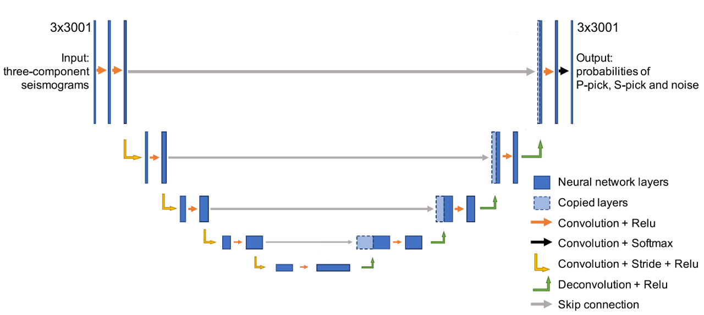
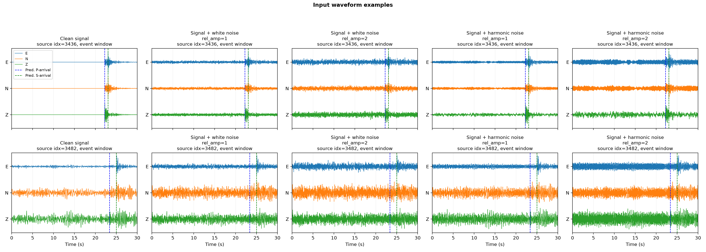
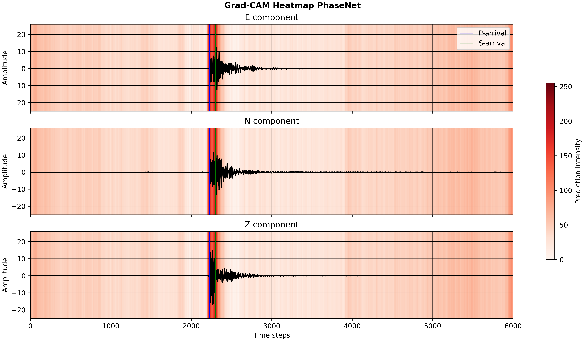
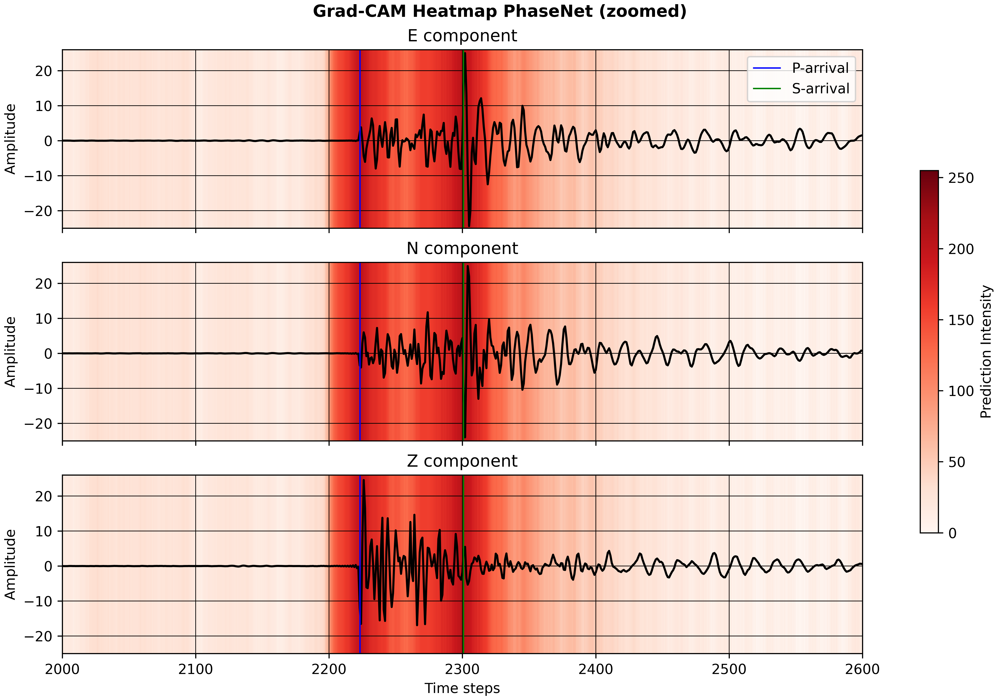
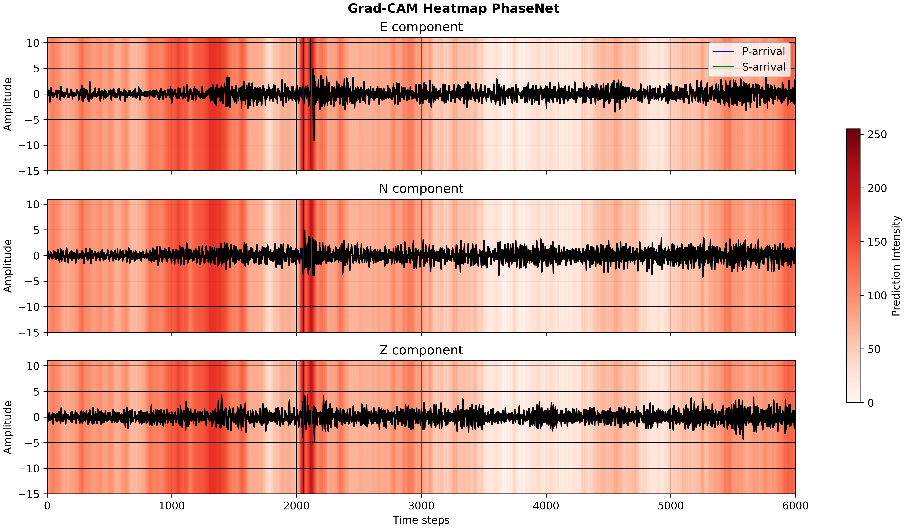
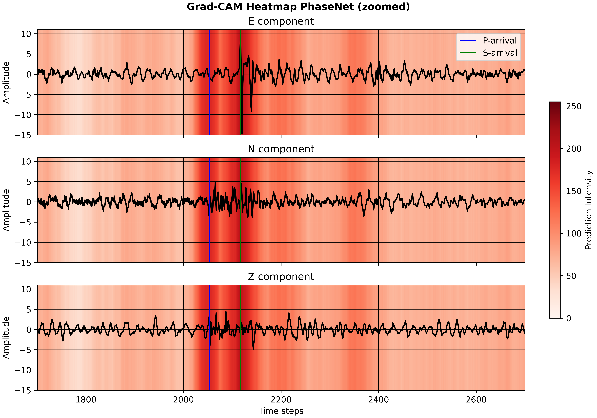
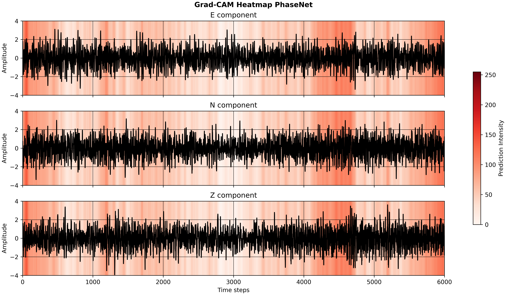
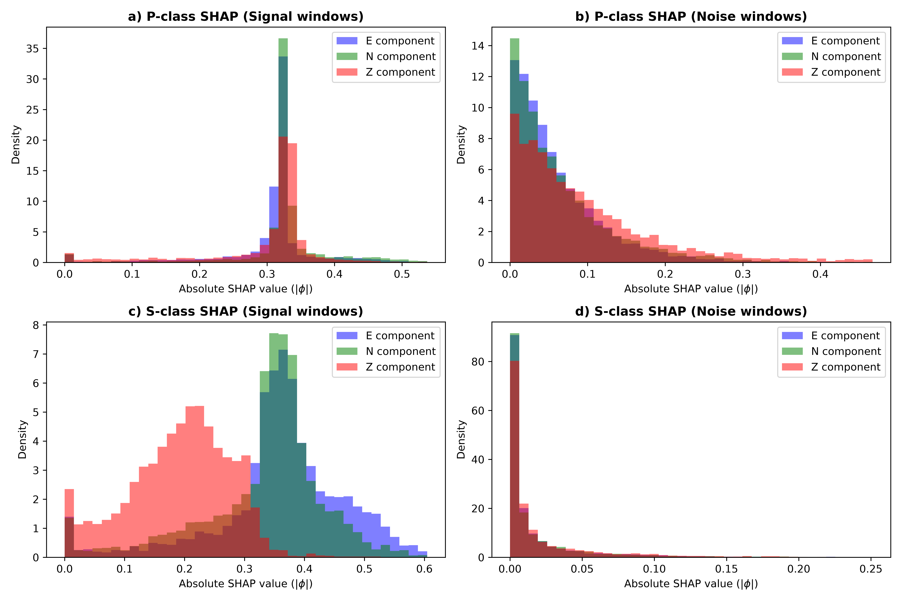
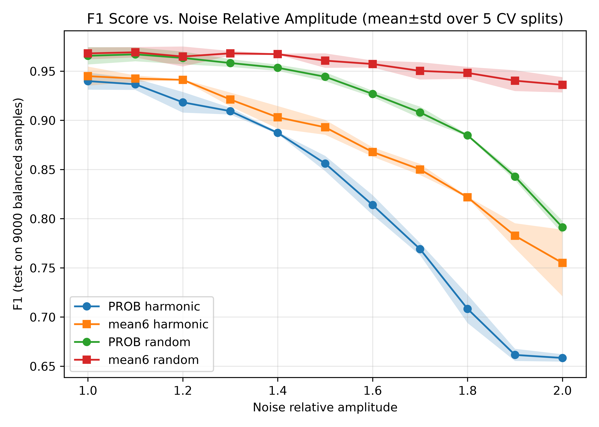

# Explainable AI for Microseismic Event Detection (PhaseNet XAI)


[](https://doi.org/10.1016/j.aiig.2026.100246)
[](https://zenodo.org/badge/latestdoi/1282764637)

This repository provides an Explainable AI (XAI) framework for interpreting and enhancing the performance of the PhaseNet microseismic event detection model. It contains the refactored code accompanying the manuscript:

> Abdullin, A., Anikiev, D., & Waheed, U. b. (2026). Explainable AI for microseismic event detection. Artificial Intelligence in Geosciences, 100246. DOI: [10.1016/j.aiig.2026.100246](https://doi.org/10.1016/j.aiig.2026.100246)

```bibtex
@article{AbdullinEtAl2026Explainable,
 title = {Explainable AI for microseismic event detection},
 journal = {Artificial Intelligence in Geosciences},
 pages = {100246},
 year = {2026},
 issn = {2666-5441},
 doi = {https://doi.org/10.1016/j.aiig.2026.100246},
 author = {Abdullin, Ayrat and Anikiev, Denis and Waheed, Umair Bin},
}
```

If you use this code in your research, please cite the above manuscript.

## Features

- **Grad-CAM Visualization**: Generate localized heatmaps over the waveform to see which phases PhaseNet focuses on.
- **SHAP Component Analysis**: Compute exact Shapley values across the 3 waveform components (East, North, Vertical) without computationally prohibitive sample-wise approximations.
- **SHAP-Gated Inference**: Use a robust, explanation-based metric (mean absolute SHAP across components) to confidently detect true events even under strong noise, reducing false alarms.
- **Noise Robustness Evaluation**: Inject synthetic white noise or real harmonic pump noise to test the deterioration of probability-only versus SHAP-gated detection.

**Schematic illustration of the network architecture:**


## Reproduction Scope

This repository provides maintained, tested scripts for the central manuscript
reproduction workflows: Grad-CAM examples for Figures 2 and 3, component-wise
SHAP histograms for Figure 4, SHAP extension analyses for Figures 5-8, and the
noise-robustness analyses for Figures 9-11.

## Installation

The recommended setup uses Conda or Mamba. This repository includes separate
environment files for CPU-only and CUDA-enabled PyTorch installs.

For a portable CPU-only environment:

```bash
conda env create -f environment-cpu.yml
conda activate xai-phasenet-cpu
```

For an Ubuntu GPU environment with CUDA-enabled PyTorch:

```bash
conda env create -f environment-gpu.yml
conda activate xai-phasenet-gpu
```

Both Conda environments install the project in editable mode and include the
dependencies from `requirements.txt`. `seisbench` is installed through `pip`
inside the Conda environment because it is not available from `conda-forge` on
the checked Windows targets.

The GPU environment installs PyTorch `2.7.0+cu128` from the official PyTorch
CUDA 12.8 wheel index. It requires a compatible NVIDIA driver on the host
system.

If you prefer a pip-only setup, you can install the required dependencies with:

```bash
pip install -r requirements.txt
```

Then install the package in editable mode:

```bash
pip install -e .
```

To smoke-test the figure reproduction workflow without the large manuscript
datasets, run the synthetic fixture test:

```bash
python -m unittest tests.test_reproduce_figures
```

This test creates temporary waveforms and model weights, runs the input-data
visualizer plus the figure reproduction scripts, and verifies that the expected
PNG and cached data files are produced.

## Structure

- `xai_phasenet/`: The core python package.
  - `model.py`: Modified PhaseNet class supporting Grad-CAM.
  - `gradcam.py`: Logic to generate localization maps.
  - `shap_utils.py`: Analytical Shapley value computation.
  - `noise_utils.py`: Harmonic and white noise injection.
  - `inference.py`: SHAP-gated inference logic.
  - `original.pt.v2`: Bundled pretrained PhaseNet weights used by the reproduction scripts.
- `scripts/`: Example scripts to reproduce the manuscript's results.
  - `visualize_input_data.py`: Visualizes clean signal traces and the same traces with injected white or harmonic noise.
  - `reproduce_figures_2_and_3_gradcam.py`: Reproduces the Grad-CAM waveform and zoom panels for Figures 2 and 3.
  - `reproduce_figure_4_shap_analysis.py`: Reproduces the component-wise SHAP histograms for Figure 4.
  - `reproduce_figures_5_to_8_shap_extensions.py`: Reproduces the SHAP violin, interaction, reduced-component, and dispersion analyses for Figures 5-8.
  - `reproduce_figures_9_to_11_noise_robustness.py`: Reproduces the noise-robustness evaluations for Figures 9-11.
- `datasets/`: Local manuscript tensors and index files used by the reproduction scripts.
- `figures/`: Reference figure images used in this README.

## Datasets

The reproduction scripts expect the manuscript data files in `datasets/`.
These files are large, so the unit tests create small synthetic fixtures instead
of loading the full datasets.

- `x_test_5391ev_270425.pt`: Main waveform tensor used for signal/event examples.
- `y_test_5391ev_270425.pt`: Labels for the main waveform tensor; nonzero labels are treated as signal/event windows.
- `x_noise_6480ev_270425.pt`: Pure-noise waveform tensor used for noise examples and balanced evaluations.
- `indices_signal_140425.npy`: Fixed index order used to select signal/event windows from the nonzero-labeled entries in `x_test_5391ev_270425.pt`.
- `indices_noise_140425.npy`: Fixed index order used to select pure-noise windows from `x_noise_6480ev_270425.pt`.
- `x_harmonic_5ev_stand_210925.pt`: Field harmonic-noise bank used by the noise robustness experiment. This dataset contains strong pump-induced harmonic noise from an independent field acquisition.

## Results & Usage Examples

Below are examples of the key manuscript results you can reproduce using the
provided scripts.

### 0. Visualize Input Data

Before reproducing the main figures, it can be useful to inspect the waveform
inputs directly. This helper plots a few clean signal examples, the same signals
with injected white noise and injected harmonic noise at relative amplitudes
`1.0` and `2.0`. Source indices and event/noise label summaries are included in
the panel titles.

```bash
python scripts/visualize_input_data.py
```

By default, the figure is written to:

```text
output/data/input_data_examples.png
```

**Input Data Examples:**


The dataset labels are binary event/noise labels representing predicted P- and S-wave arrivals. By default, the script overlays PhaseNet-predicted P and S arrival times
as dashed vertical lines. Pass `--arrival-source none` to hide these markers.
The script uses the real harmonic-noise bank by default. To use the synthetic
harmonic fallback instead, pass `--noise-bank-path none`. Use `--rel-amps` to
change the injected noise amplitudes.

### 1. Grad-CAM Heatmaps (Figure 2 & 3)

We use Grad-CAM to visualize which portions of the waveform PhaseNet uses to trigger a detection. 
The script generates full traces and zoomed windows, overlaying the P and S arrivals.

```bash
python scripts/reproduce_figures_2_and_3_gradcam.py
```

The script defaults to `datasets/` and `xai_phasenet/original.pt.v2`. Run
`python scripts/reproduce_figures_2_and_3_gradcam.py --help` to override paths,
sample counts, output directory, device, or plotting DPI. By default, outputs
are written to `output/figures_2_and_3_gradcam`.

**High SNR Sample (Figure 2 & 3):**



**Low SNR Sample (Figure 2 & 3):**



**Pure Noise Sample (Figure 2):**


### 2. SHAP Value Analysis (Figure 4)

We analytically compute the Shapley values across the E, N, and Z components to understand the component-level contributions for P- and S-class predictions.

```bash
python scripts/reproduce_figure_4_shap_analysis.py
```

The default command mirrors the manuscript Figure 4 calculation: it uses the
first 5,000 signal windows and 5,000 noise windows, crops each waveform to the
first 3,001 samples, and computes one zero-baseline SHAP value set with
`win=3001`, `hop=1`, and max P/S probability aggregation. The combined panel is
written to `output/figure_4_shap_analysis/Figure4_SHAP_histograms.png`; cached SHAP arrays are
kept in `output/figure_4_shap_analysis/shap_data` unless `--cache-dir` is provided. Run
`python scripts/reproduce_figure_4_shap_analysis.py --help` to choose a smaller
`--n-test` or override the cache/output directory.

**Distributions of Absolute SHAP Values:**


### 3. SHAP Extension Analyses (Figures 5-8)

The next SHAP analyses build on the same 5,000 signal and
5,000 pure-noise windows used for Figure 4. This script reproduces the violin
plots of absolute SHAP distributions, the pairwise SHAP interaction histograms,
the reduced-component performance plot, and the SHAP-dispersion-versus-SNR
scatter plot.

```bash
python scripts/reproduce_figures_5_to_8_shap_extensions.py
```

By default, outputs are written to `output/figures_5_to_8_shape_extensions`. The script reuses a
compatible `output/figure_4_shap_analysis/shap_data` cache when available, then writes its own
SHAP and interaction caches to `output/figures_5_to_8_shape_extensions/shap_data`. Figure 7 is
plotted from the manuscript summary values included in the script; pass
`--recompute-figure7` to rerun the reduced-component ablation.

### 4. Evaluate Noise Robustness (Figures 9-11)

We evaluate detector robustness under synthetic and harmonic noise injections using both probability-only and SHAP-gated criteria.

```bash
python scripts/reproduce_figures_9_to_11_noise_robustness.py
```

By default, this runs the full manuscript reproduction protocol:

- both random/white noise and real harmonic pump noise
- relative noise amplitudes from `1.0` to `2.0` in steps of `0.1`
- an additional extended harmonic-noise sweep from `0.0` to `5.0` in steps of `0.1`
- `5000` signal windows and `5000` noise windows
- `5` CV splits with `50/50` signal/noise training windows
- `4500/4500` signal/noise test windows per split
- the first `3001` samples of each trace, with `win=3001` and `hop=1`

The default output figures are:

```text
output/figures_9_to_11_noise_robustness/Figure9_Noise_Robustness.png
output/figures_9_to_11_noise_robustness/Figure10_Precision_Recall_Noise_Robustness.png
output/figures_9_to_11_noise_robustness/Figure11_Extended_F1_Noise_Robustness.png
```

**Noise Robustness (Figure 9):**


The script uses the bundled weights at `xai_phasenet/original.pt.v2` and the
local manuscript datasets:

```text
datasets/x_test_5391ev_270425.pt
datasets/y_test_5391ev_270425.pt
datasets/x_noise_6480ev_270425.pt
datasets/indices_signal_140425.npy
datasets/indices_noise_140425.npy
datasets/x_harmonic_5ev_stand_210925.pt
```

It writes split-level metrics, summary metrics, cached scores,
`cv_all_metrics_wn.npz`, `cv_all_metrics_hn.npz`,
`cv_all_metrics_hn_extended.npz`, and the Figure 9-11 plots to the output
directory. The robustness evaluation follows the manuscript setup by using
`max_t(1 - P_noise(t))` as the PROB score and `mean6` as the SHAP score.

For a quick smoke run:

```bash
python scripts/reproduce_figures_9_to_11_noise_robustness.py \
  --output-dir output/figure9_noise_smoke \
  --noise-type both \
  --num-samples 10 \
  --rel-amps 1.0 \
  --extended-rel-amps 1.0 \
  --n-splits 1 \
  --train-per-class 2 \
  --test-per-class 4 \
  --hop 3001
```

Use `python scripts/reproduce_figures_9_to_11_noise_robustness.py --help` to change the
noise type, relative amplitudes, sample count, thresholds, device, or dataset
paths. To use the synthetic harmonic fallback instead of the real data
pump-noise bank, pass `--noise-bank-path none`.

The full default run is computationally expensive because it evaluates 73 noise
sweep points with SHAP: 22 standard white/harmonic points for Figures 9-10 and
51 extended harmonic points for Figure 11. The overlapping harmonic amplitudes
from `1.0` to `2.0` reuse the standard-sweep score cache during the same run.
Re-running in the same output directory reuses cached scores unless
`--force-recompute` is passed. Pass `--skip-extended` if you only need Figures 9
and 10.

**Note:** Small point-by-point deviations from the published plots are expected. 
The manuscript figures were assembled from saved intermediate metric arrays, while this script recomputes the extended harmonic-noise sweep, SHAP scores, and CV thresholds from the data. 
The overall trend and relative behavior should match the manuscript.
